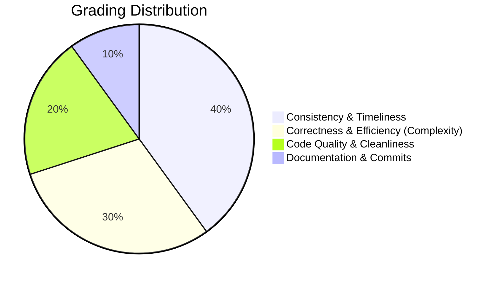

# 🚀 Summer_Assignment_2401920130209 | DSA & OOPS Summer Assignment

Welcome to my submission repository for the **4-Week DSA & OOPS Summer Assignment** under the **Mentor-Mentee Model Program 2026**. This repository contains solutions to curated LeetCode problems and Object-Oriented Programming (OOP) case studies designed to build a strong foundation in problem-solving and software engineering principles.

---

## 🎯 Badges & Project Status

<div align="left">
  
  
  
  
  
</div>

---

## 👤 Student Information

> [!NOTE]
> Below are my official details for verification and tracking of this summer assignment.

<table align="center" width="100%">
  <tr>
    <td width="30%" align="center">
      <br/>
      <b>Vaibhav Singh</b><br/>
      <a href="https://github.com/MrUnknown-47">@MrUnknown-47</a>
    </td>
    <td width="70%">
      <table>
        <tr>
          <td><b>Name:</b></td>
          <td>Vaibhav Singh</td>
        </tr>
        <tr>
          <td><b>Roll Number:</b></td>
          <td><code>2401920130209</code></td>
        </tr>
        <tr>
          <td><b>Department:</b></td>
          <td>Computer Science & Engineering</td>
        </tr>
        <tr>
          <td><b>Institution:</b></td>
          <td>[Insert Institution Name Here]</td>
        </tr>
        <tr>
          <td><b>Email:</b></td>
          <td><a href="mailto:vaibhavsingh8d36@gmail.com">vaibhavsingh8d36@gmail.com</a></td>
        </tr>
        <tr>
          <td><b>Batch:</b></td>
          <td>2024 - 2028 (Batch of 2028)</td>
        </tr>
      </table>
    </td>
  </tr>
</table>

---

## 👥 Mentor Information

> [!TIP]
> Under the guidance of my designated mentors, I will be working on improving my algorithmic efficiency and design pattern implementations.

| Parameter | Details |
| :--- | :--- |
| **Mentor Name** | [Insert Mentor Name Here] |
| **Designation** | Mentor / Senior Guide |
| **Department** | Computer Science & Engineering |
| **Mentor Email** | [Insert Mentor Email Here] |
| **Review Cadence** | Weekly Feedback & Repository Audits |

---

## 📅 Assignment Overview & Schedule

The program runs for **4 Weeks**, starting on **June 1, 2026**. The workload is designed to ensure consistent practice:
- 💡 **DSA Component**: **3 LeetCode problems daily** (Monday to Friday) $\rightarrow$ *15 problems/week | 60 problems total.*
- 🏗️ **OOPS Component**: **1 OOPS problem weekly** $\rightarrow$ *1 problem/week | 4 projects total.*
- 🚀 **Commit Cadence**: Solutions must be uploaded **daily** to this repository.

### 🗓️ Weekly Topics & Schedule

| Week | Date Range | DSA Focus Topics | OOPS Weekly Topic | Target Submissions |
| :---: | :---: | :--- | :--- | :---: |
| **Week 1** | June 01 - June 05 | Arrays, Prefix Sum, Sliding Window, Two Pointers, Matrix, Basic Strings | Encapsulation & Abstraction | 15 DSA + 1 OOPS |
| **Week 2** | June 08 - June 12 | Advanced Strings, Hashing, Pattern Matching, Recursion | Inheritance & Polymorphism | 15 DSA + 1 OOPS |
| **Week 3** | June 15 - June 19 | Linked List, Stack, Queue, Deque | Interfaces & Abstract Classes | 15 DSA + 1 OOPS |
| **Week 4** | June 22 - June 26 | Binary Trees, BST, Traversals, Advanced Trees | Design Patterns & OOPS Case Study | 15 DSA + 1 OOPS |

---

## 📂 Repository Structure

The project directory is structured cleanly by weeks and days. Each week contains folders for the respective days of coding, alongside an `OOPS` folder for that week's OOP assignment.

```text
Summer_Assignment_2401920130209/
├── README.md
├── createFolder.py
├── Week_1/
│   ├── Day_1/
│   │   ├── LC_1_TwoSum.cpp
│   │   ├── LC_15_3Sum.cpp
│   │   └── LC_11_ContainerWithMostWater.cpp
│   ├── Day_2/
│   ├── Day_3/
│   ├── Day_4/
│   ├── Day_5/
│   └── OOPS/
│       └── OOPS_Encapsulation_BankAccount.cpp
├── Week_2/
│   ├── Day_1/ ... Day_5/
│   └── OOPS/
├── Week_3/
│   ├── Day_1/ ... Day_5/
│   └── OOPS/
└── Week_4/
    ├── Day_1/ ... Day_5/
    └── OOPS/
```

---

## 📝 Naming Conventions & Guidelines

To maintain structure and readability, all file names must adhere to the following standards:

### 1. LeetCode Problems (DSA)
File names must start with `LC_` followed by the problem number, and the problem name in CamelCase.
*   **Format**: `LC_<ProblemNumber>_<ProblemName>.<extension>`
*   **Example (C++)**: `LC_1_TwoSum.cpp`
*   **Example (Python)**: `LC_121_BestTimeToBuyAndSellStock.py`

### 2. OOPS Assignments
File names must represent the design pattern or concept implemented.
*   **Format**: `OOPS_<ConceptName>_<ProjectName>.<extension>`
*   **Example (Java)**: `OOPS_Inheritance_EmployeeSystem.java`
*   **Example (C++)**: `OOPS_Encapsulation_LibraryManagement.cpp`

---

## 🛠️ Submission & Git Guidelines

> [!IMPORTANT]
> To maintain the integrity of daily progress, follow these commit guidelines.

1. **Daily Push**: Commits must be pushed to GitHub before **11:59 PM** on the respective day.
2. **Semantic Commit Messages**:
   - For daily problems: `feat(Week1-Day1): add solutions for LC#1, LC#15, and LC#11`
   - For OOPS assignments: `feat(Week1-OOPS): implement BankAccount system demonstrating Encapsulation`
   - For corrections: `fix(Week1-Day2): optimize time complexity of LC#76`
3. **Complexity Analysis**:
   - Every solution file must include a header comment describing the **Time Complexity** and **Space Complexity** of the approach.
   - Example:
     ```cpp
     // Time Complexity: O(N log N)
     // Space Complexity: O(1)
     ```

---

## 📊 Progress Tracker

Use this checklist to track your progress as you complete each week's assignments:

### 📅 Week 1 Tracker
- [ ] **Day 1: Arrays & Prefix Sum**
  - [ ] Problem 1: [LC 1 - Two Sum](https://leetcode.com/problems/two-sum/)
  - [ ] Problem 2: [LC 167 - Two Sum II](https://leetcode.com/problems/two-sum-ii-input-array-is-sorted/)
  - [ ] Problem 3: [LC 15 - 3Sum](https://leetcode.com/problems/3sum/)
- [ ] **Day 2: Sliding Window**
  - [ ] Problem 1: [LC 209 - Minimum Size Subarray Sum](https://leetcode.com/problems/minimum-size-subarray-sum/)
  - [ ] Problem 2: [LC 3 - Longest Substring Without Repeating Characters](https://leetcode.com/problems/longest-substring-without-repeating-characters/)
  - [ ] Problem 3: [LC 424 - Longest Repeating Character Replacement](https://leetcode.com/problems/longest-repeating-character-replacement/)
- [ ] **Day 3: Two Pointers**
  - [ ] Problem 1: [LC 125 - Valid Palindrome](https://leetcode.com/problems/valid-palindrome/)
  - [ ] Problem 2: [LC 11 - Container With Most Water](https://leetcode.com/problems/container-with-most-water/)
  - [ ] Problem 3: [LC 42 - Trapping Rain Water](https://leetcode.com/problems/trapping-rain-water/)
- [ ] **Day 4: Matrix Manipulation**
  - [ ] Problem 1: [LC 48 - Rotate Image](https://leetcode.com/problems/rotate-image/)
  - [ ] Problem 2: [LC 54 - Spiral Matrix](https://leetcode.com/problems/spiral-matrix/)
  - [ ] Problem 3: [LC 73 - Set Matrix Zeroes](https://leetcode.com/problems/set-matrix-zeroes/)
- [ ] **Day 5: Basic Strings**
  - [ ] Problem 1: [LC 14 - Longest Common Prefix](https://leetcode.com/problems/longest-common-prefix/)
  - [ ] Problem 2: [LC 58 - Length of Last Word](https://leetcode.com/problems/length-of-last-word/)
  - [ ] Problem 3: [LC 28 - Find the Index of the First Occurrence in a String](https://leetcode.com/problems/find-the-index-of-the-first-occurrence-in-a-string/)
- [ ] **🏗️ Week 1 OOPS Assignment**
  - [ ] OOP Project: Encapsulation & Abstraction (e.g. Bank Account System)

---

### 📅 Week 2 Tracker
- [ ] **Day 1: Advanced Strings**
  - [ ] Problem 1: [LC 76 - Minimum Window Substring](https://leetcode.com/problems/minimum-window-substring/)
  - [ ] Problem 2: [LC 49 - Group Anagrams](https://leetcode.com/problems/group-anagrams/)
  - [ ] Problem 3: [LC 438 - Find All Anagrams in a String](https://leetcode.com/problems/find-all-anagrams-in-a-string/)
- [ ] **Day 2: Hashing**
  - [ ] Problem 1: [LC 347 - Top K Frequent Elements](https://leetcode.com/problems/top-k-frequent-elements/)
  - [ ] Problem 2: [LC 128 - Longest Consecutive Sequence](https://leetcode.com/problems/longest-consecutive-sequence/)
  - [ ] Problem 3: [LC 560 - Subarray Sum Equals K](https://leetcode.com/problems/subarray-sum-equals-k/)
- [ ] **Day 3: Pattern Matching**
  - [ ] Problem 1: [LC 28 - Implement strStr() (KMP Algorithm)](https://leetcode.com/problems/find-the-index-of-the-first-occurrence-in-a-string/)
  - [ ] Problem 2: [LC 214 - Shortest Palindrome](https://leetcode.com/problems/shortest-palindrome/)
  - [ ] Problem 3: [LC 459 - Repeated Substring Pattern](https://leetcode.com/problems/repeated-substring-pattern/)
- [ ] **Day 4: Basic Recursion**
  - [ ] Problem 1: [LC 509 - Fibonacci Number](https://leetcode.com/problems/fibonacci-number/)
  - [ ] Problem 2: [LC 206 - Reverse Linked List (Recursive)](https://leetcode.com/problems/reverse-linked-list/)
  - [ ] Problem 3: [LC 344 - Reverse String](https://leetcode.com/problems/reverse-string/)
- [ ] **Day 5: Advanced Recursion / Backtracking**
  - [ ] Problem 1: [LC 78 - Subsets](https://leetcode.com/problems/subsets/)
  - [ ] Problem 2: [LC 46 - Permutations](https://leetcode.com/problems/permutations/)
  - [ ] Problem 3: [LC 39 - Combination Sum](https://leetcode.com/problems/combination-sum/)
- [ ] **🏗️ Week 2 OOPS Assignment**
  - [ ] OOP Project: Inheritance & Polymorphism (e.g. Employee Payroll Management)

---

### 📅 Week 3 Tracker
- [ ] **Day 1: Singly Linked List**
  - [ ] Problem 1: [LC 141 - Linked List Cycle](https://leetcode.com/problems/linked-list-cycle/)
  - [ ] Problem 2: [LC 142 - Linked List Cycle II](https://leetcode.com/problems/linked-list-cycle-ii/)
  - [ ] Problem 3: [LC 19 - Remove Nth Node From End of List](https://leetcode.com/problems/remove-nth-node-from-end-of-list/)
- [ ] **Day 2: Doubly/Circular Linked List**
  - [ ] Problem 1: [LC 430 - Flatten a Multilevel Doubly Linked List](https://leetcode.com/problems/flatten-a-multilevel-doubly-linked-list/)
  - [ ] Problem 2: [LC 146 - LRU Cache](https://leetcode.com/problems/lru-cache/)
  - [ ] Problem 3: [LC 707 - Design Linked List](https://leetcode.com/problems/design-linked-list/)
- [ ] **Day 3: Stack Operations**
  - [ ] Problem 1: [LC 20 - Valid Parentheses](https://leetcode.com/problems/valid-parentheses/)
  - [ ] Problem 2: [LC 155 - Min Stack](https://leetcode.com/problems/min-stack/)
  - [ ] Problem 3: [LC 84 - Largest Rectangle in Histogram](https://leetcode.com/problems/largest-rectangle-in-histogram/)
- [ ] **Day 4: Queue & Deque**
  - [ ] Problem 1: [LC 225 - Implement Stack using Queues](https://leetcode.com/problems/implement-stack-using-queues/)
  - [ ] Problem 2: [LC 232 - Implement Queue using Stacks](https://leetcode.com/problems/implement-queue-using-stacks/)
  - [ ] Problem 3: [LC 239 - Sliding Window Maximum](https://leetcode.com/problems/sliding-window-maximum/)
- [ ] **Day 5: Advanced Stack/Queue Applications**
  - [ ] Problem 1: [LC 739 - Daily Temperatures](https://leetcode.com/problems/daily-temperatures/)
  - [ ] Problem 2: [LC 503 - Next Greater Element II](https://leetcode.com/problems/next-greater-element-ii/)
  - [ ] Problem 3: [LC 901 - Online Stock Span](https://leetcode.com/problems/online-stock-span/)
- [ ] **🏗️ Week 3 OOPS Assignment**
  - [ ] OOP Project: Interfaces & Abstract Classes (e.g. Payment Gateway Integration System)

---

### 📅 Week 4 Tracker
- [ ] **Day 1: Binary Trees Basics**
  - [ ] Problem 1: [LC 104 - Maximum Depth of Binary Tree](https://leetcode.com/problems/maximum-depth-of-binary-tree/)
  - [ ] Problem 2: [LC 110 - Balanced Binary Tree](https://leetcode.com/problems/balanced-binary-tree/)
  - [ ] Problem 3: [LC 543 - Diameter of Binary Tree](https://leetcode.com/problems/diameter-of-binary-tree/)
- [ ] **Day 2: Tree Traversals**
  - [ ] Problem 1: [LC 102 - Binary Tree Level Order Traversal](https://leetcode.com/problems/binary-tree-level-order-traversal/)
  - [ ] Problem 2: [LC 103 - Binary Tree Zigzag Level Order Traversal](https://leetcode.com/problems/binary-tree-zigzag-level-order-traversal/)
  - [ ] Problem 3: [LC 124 - Binary Tree Maximum Path Sum](https://leetcode.com/problems/binary-tree-maximum-path-sum/)
- [ ] **Day 3: Binary Search Trees (BST)**
  - [ ] Problem 1: [LC 98 - Validate Binary Search Tree](https://leetcode.com/problems/validate-binary-search-tree/)
  - [ ] Problem 2: [LC 230 - Kth Smallest Element in a BST](https://leetcode.com/problems/kth-smallest-element-in-a-bst/)
  - [ ] Problem 3: [LC 108 - Convert Sorted Array to Binary Search Tree](https://leetcode.com/problems/convert-sorted-array-to-binary-search-tree/)
- [ ] **Day 4: Tree Construction & Serialization**
  - [ ] Problem 1: [LC 105 - Construct Binary Tree from Preorder and Inorder Traversal](https://leetcode.com/problems/construct-binary-tree-from-preorder-and-inorder-traversal/)
  - [ ] Problem 2: [LC 297 - Serialize and Deserialize Binary Tree](https://leetcode.com/problems/serialize-and-deserialize-binary-tree/)
  - [ ] Problem 3: [LC 236 - Lowest Common Ancestor of a Binary Tree](https://leetcode.com/problems/lowest-common-ancestor-of-a-binary-tree/)
- [ ] **Day 5: Advanced Trees (Tries/Segment Trees)**
  - [ ] Problem 1: [LC 208 - Implement Trie (Prefix Tree)](https://leetcode.com/problems/implement-trie-prefix-tree/)
  - [ ] Problem 2: [LC 211 - Design Add and Search Words Data Structure](https://leetcode.com/problems/design-add-and-search-words-data-structure/)
  - [ ] Problem 3: [LC 307 - Range Sum Query - Mutable](https://leetcode.com/problems/range-sum-query-mutable/)
- [ ] **🏗️ Week 4 OOPS Assignment**
  - [ ] OOP Project: Design Patterns & Case Study (e.g. Parking Lot Design / Factory Pattern System)

---

## 📈 Evaluation Criteria

Mentors will evaluate the submissions based on the following metrics:



1.  **Consistency & Timeliness (40%)**:
    *   Continuous daily commits without gaps.
    *   Adherence to daily and weekly deadlines.
2.  **Correctness & Efficiency (30%)**:
    *   Solutions must successfully pass all LeetCode test cases.
    *   Algorithmic complexity must be optimized (e.g., using prefix sums instead of $O(N^2)$ checks).
3.  **Code Quality & Cleanliness (20%)**:
    *   Readable code with descriptive variable names.
    *   Proper class structures for OOP tasks.
    *   Explanatory comments for complex logic.
4.  **Documentation & Commits (10%)**:
    *   Proper directory hierarchy and file naming.
    *   Detailed commit descriptions.

---

## 📊 GitHub Activity and Statistics

<div align="center">
  <h3>⚡ Coding Stats & Metrics ⚡</h3>
  
  <p align="center">
    
    
  </p>

  <p align="center">
    
  </p>
</div>

---

## 📜 Footer & Inspirational Quote

> "First, solve the problem. Then, write the code."
> — *John Johnson*

<div align="center">
  <sub>Made with ❤️ by <b>Vaibhav Singh</b>. Happy Coding! 💻</sub>
</div>
